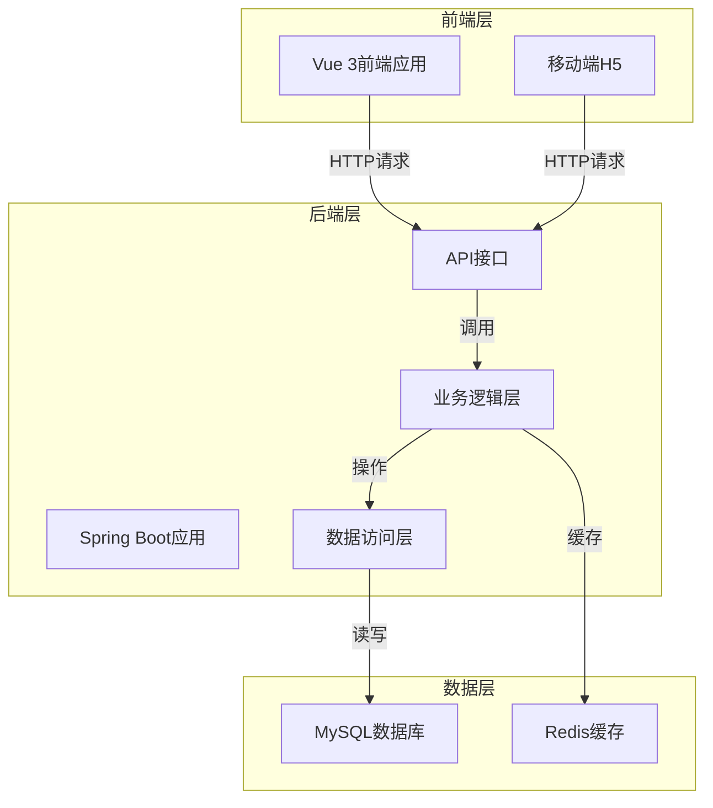

# 中草药溯源管理系统技术方案

## 1. 系统架构

### 1.1 技术栈
- **后端**：Spring Boot + MyBatis-Plus + Spring Security
- **前端**：Vue 3 + Element Plus + Axios
- **数据库**：MySQL
- **缓存**：Redis
- **认证**：JWT

### 1.2 系统架构图

## 2. 角色设计

### 2.1 角色列表
| 角色名称 | 角色代码 | 描述 |
|---------|---------|------|
| 系统管理员 | sys_admin | 负责系统整体配置、用户管理和权限分配 |
| 政府管理员 | gov_admin | 负责生产质量检测管理、评分评级与评价 |
| 生产者 | producer | 负责生产过程记录、生产基地管理、产品管理 |
| 消费者 | consumer | 负责追溯查询、评分推荐、筛选机制 |

### 2.2 权限设计
基于RuoYi-Vue的RBAC权限模型，为每个角色分配相应的权限：

| 功能模块 | 系统管理员 | 政府管理员 | 生产者 | 消费者 |
|---------|-----------|-----------|--------|--------|
| 用户管理 | ✓ | ✗ | ✗ | ✗ |
| 角色管理 | ✓ | ✗ | ✗ | ✗ |
| 菜单管理 | ✓ | ✗ | ✗ | ✗ |
| 生产过程记录 | ✗ | ✓ | ✓ | ✗ |
| 生产基地管理 | ✗ | ✓ | ✓ | ✗ |
| 产品管理 | ✗ | ✓ | ✓ | ✗ |
| 追溯查询 | ✗ | ✓ | ✓ | ✓ |
| 评分推荐 | ✗ | ✗ | ✗ | ✓ |
| 筛选机制 | ✗ | ✗ | ✗ | ✓ |
| 生产质量检测管理 | ✗ | ✓ | ✗ | ✗ |
| 评分评级与评价 | ✗ | ✓ | ✗ | ✗ |
| 页面与内容控制 | ✓ | ✗ | ✗ | ✗ |
| 系统基础运维 | ✓ | ✗ | ✗ | ✗ |

## 3. 功能模块设计

### 3.1 生产者模块

#### 3.1.1 生产过程记录
- **功能描述**：记录中草药从“种子/种苗 -> 种植 -> 施肥/用药 -> 采收 -> 初加工 -> 包装”的全生命周期信息，支持按“批次（Batch）”进行数据绑定。
- **数据结构**：
  - 批次信息（Batch）：批次ID、批次名称、产品ID、生产基地ID、开始时间、结束时间、状态等
  - 生产过程记录（ProductionProcess）：记录ID、批次ID、环节类型（种子/种苗、种植、施肥/用药、采收、初加工、包装）、操作时间、操作人、操作内容、附件等

#### 3.1.2 生产基地管理
- **功能描述**：维护种植基地的基本信息（地理位置、面积、土壤/水源检测报告等），为溯源提供源头环境背书。
- **数据结构**：
  - 生产基地（ProductionBase）：基地ID、基地名称、地理位置、面积、土壤检测报告、水源检测报告、环境评估报告、状态等

#### 3.1.3 产品管理
- **功能描述**：维护企业所生产的中草药产品名录（品类、规格、功效说明）、库存状态以及生成溯源码（批次码）。
- **数据结构**：
  - 产品信息（Product）：产品ID、产品名称、品类、规格、功效说明、生产企业ID等
  - 库存信息（Inventory）：库存ID、产品ID、批次ID、数量、入库时间、出库时间、状态等
  - 溯源码（TraceabilityCode）：溯源码ID、批次ID、溯源码值、生成时间、状态等

### 3.2 消费者模块

#### 3.2.1 追溯查询
- **功能描述**：用户通过输入追溯码或扫码，查看某批次中草药的完整溯源档案（产地、加工流程、质检报告等）。
- **数据结构**：
  - 追溯记录（TraceRecord）：记录ID、溯源码、用户ID、查询时间、IP地址等

#### 3.2.2 评分推荐
- **功能描述**：消费者在购买/使用后，可以对特定批次的产品或生产企业进行打分和评价；系统基于评分数据向其他消费者推荐优质产品。
- **数据结构**：
  - 评价信息（Evaluation）：评价ID、用户ID、批次ID/企业ID、评分、评价内容、评价时间等
  - 推荐记录（Recommendation）：推荐ID、用户ID、产品ID、推荐理由、推荐时间等

#### 3.2.3 筛选机制
- **功能描述**：支持多维度检索，例如，按产地、中草药种类、政府评级、消费者评分等条件筛选企业或产品。
- **数据结构**：
  - 筛选条件（FilterCondition）：条件ID、用户ID、筛选类型、筛选值、创建时间等

### 3.3 政府管理员模块

#### 3.3.1 生产质量检测管理
- **功能描述**：录入、审核或抽查生产者的质检报告（如农残、重金属检测）。若不合格，需具备下架或冻结该批次产品的能力。
- **数据结构**：
  - 质检报告（QualityInspection）：报告ID、批次ID、检测类型、检测结果、检测机构、检测时间、审核状态等
  - 产品状态（ProductStatus）：状态ID、产品ID、批次ID、状态类型（正常、下架、冻结）、操作人、操作时间、操作原因等

#### 3.3.2 评分评级与评价
- **功能描述**：结合“消费者评价”与“政府质检/抽查结果”，对生产企业进行综合信用评级（如 A/B/C/D 级，或红黑名单机制）。
- **数据结构**：
  - 企业评级（EnterpriseRating）：评级ID、企业ID、评级等级、评级时间、评级理由、操作人等
  - 黑名单（Blacklist）：黑名单ID、企业ID、加入原因、加入时间、操作人等

### 3.4 系统管理员模块

#### 3.4.1 用户与权限管理
- **功能描述**：基于RBAC（基于角色的访问控制）模型，管理各类角色的账号（开通、停用），分配系统功能权限。
- **数据结构**：
  - 用户信息（SysUser）：用户ID、用户名、密码、角色ID、状态等
  - 角色信息（SysRole）：角色ID、角色名称、角色代码、权限列表等
  - 权限信息（SysPermission）：权限ID、权限名称、权限代码、菜单ID等

#### 3.4.2 页面与内容控制
- **功能描述**：管理系统的前端展示内容（如首页公告、政策法规发布、轮播图等）。
- **数据结构**：
  - 公告信息（Notice）：公告ID、标题、内容、发布时间、发布人等
  - 政策法规（Policy）：政策ID、标题、内容、发布时间、发布人等
  - 轮播图（Carousel）：轮播图ID、图片URL、标题、链接、排序等

#### 3.4.3 系统基础运维
- **功能描述**：系统日志管理（操作日志审计，防止溯源数据被恶意篡改）、数据字典维护（如统一中草药品种分类）。
- **数据结构**：
  - 操作日志（OperLog）：日志ID、操作人、操作类型、操作内容、操作时间、IP地址等
  - 数据字典（Dict）：字典ID、字典类型、字典编码、字典名称、排序等

## 4. 数据库设计

### 4.1 核心数据表

#### 4.1.1 生产基地表（production_base）
| 字段名 | 数据类型 | 约束 | 描述 |
|-------|---------|------|------|
| base_id | BIGINT | PRIMARY KEY | 基地ID |
| base_name | VARCHAR(255) | NOT NULL | 基地名称 |
| location | VARCHAR(255) | NOT NULL | 地理位置 |
| area | DECIMAL(10,2) | NOT NULL | 面积 |
| soil_test_report | VARCHAR(500) | | 土壤检测报告 |
| water_test_report | VARCHAR(500) | | 水源检测报告 |
| environment_report | VARCHAR(500) | | 环境评估报告 |
| status | INT | NOT NULL | 状态（0-禁用，1-启用） |
| create_time | DATETIME | NOT NULL | 创建时间 |
| update_time | DATETIME | | 更新时间 |
| create_by | VARCHAR(64) | | 创建人 |
| update_by | VARCHAR(64) | | 更新人 |

#### 4.1.2 产品表（product）
| 字段名 | 数据类型 | 约束 | 描述 |
|-------|---------|------|------|
| product_id | BIGINT | PRIMARY KEY | 产品ID |
| product_name | VARCHAR(255) | NOT NULL | 产品名称 |
| category | VARCHAR(100) | NOT NULL | 品类 |
| specification | VARCHAR(255) | NOT NULL | 规格 |
| effect | TEXT | | 功效说明 |
| enterprise_id | BIGINT | NOT NULL | 生产企业ID |
| create_time | DATETIME | NOT NULL | 创建时间 |
| update_time | DATETIME | | 更新时间 |
| create_by | VARCHAR(64) | | 创建人 |
| update_by | VARCHAR(64) | | 更新人 |

#### 4.1.3 批次表（batch）
| 字段名 | 数据类型 | 约束 | 描述 |
|-------|---------|------|------|
| batch_id | BIGINT | PRIMARY KEY | 批次ID |
| batch_name | VARCHAR(255) | NOT NULL | 批次名称 |
| product_id | BIGINT | NOT NULL | 产品ID |
| base_id | BIGINT | NOT NULL | 生产基地ID |
| start_time | DATETIME | NOT NULL | 开始时间 |
| end_time | DATETIME | | 结束时间 |
| status | INT | NOT NULL | 状态（0-进行中，1-已完成） |
| create_time | DATETIME | NOT NULL | 创建时间 |
| update_time | DATETIME | | 更新时间 |
| create_by | VARCHAR(64) | | 创建人 |
| update_by | VARCHAR(64) | | 更新人 |

#### 4.1.4 生产过程记录表（production_process）
| 字段名 | 数据类型 | 约束 | 描述 |
|-------|---------|------|------|
| process_id | BIGINT | PRIMARY KEY | 记录ID |
| batch_id | BIGINT | NOT NULL | 批次ID |
| process_type | INT | NOT NULL | 环节类型（0-种子/种苗，1-种植，2-施肥/用药，3-采收，4-初加工，5-包装） |
| operation_time | DATETIME | NOT NULL | 操作时间 |
| operator | VARCHAR(64) | NOT NULL | 操作人 |
| content | TEXT | NOT NULL | 操作内容 |
| attachment | VARCHAR(500) | | 附件 |
| create_time | DATETIME | NOT NULL | 创建时间 |

#### 4.1.5 溯源码表（traceability_code）
| 字段名 | 数据类型 | 约束 | 描述 |
|-------|---------|------|------|
| code_id | BIGINT | PRIMARY KEY | 溯源码ID |
| batch_id | BIGINT | NOT NULL | 批次ID |
| code_value | VARCHAR(255) | NOT NULL | 溯源码值 |
| status | INT | NOT NULL | 状态（0-未使用，1-已使用） |
| create_time | DATETIME | NOT NULL | 创建时间 |

#### 4.1.6 质检报告表（quality_inspection）
| 字段名 | 数据类型 | 约束 | 描述 |
|-------|---------|------|------|
| inspection_id | BIGINT | PRIMARY KEY | 报告ID |
| batch_id | BIGINT | NOT NULL | 批次ID |
| inspection_type | VARCHAR(100) | NOT NULL | 检测类型 |
| inspection_result | TEXT | NOT NULL | 检测结果 |
| inspection_organization | VARCHAR(255) | NOT NULL | 检测机构 |
| inspection_time | DATETIME | NOT NULL | 检测时间 |
| audit_status | INT | NOT NULL | 审核状态（0-待审核，1-审核通过，2-审核不通过） |
| create_time | DATETIME | NOT NULL | 创建时间 |
| update_time | DATETIME | | 更新时间 |
| create_by | VARCHAR(64) | | 创建人 |
| update_by | VARCHAR(64) | | 更新人 |

#### 4.1.7 评价表（evaluation）
| 字段名 | 数据类型 | 约束 | 描述 |
|-------|---------|------|------|
| evaluation_id | BIGINT | PRIMARY KEY | 评价ID |
| user_id | BIGINT | NOT NULL | 用户ID |
| target_id | BIGINT | NOT NULL | 目标ID（批次ID或企业ID） |
| target_type | INT | NOT NULL | 目标类型（0-批次，1-企业） |
| score | INT | NOT NULL | 评分（1-5星） |
| content | TEXT | | 评价内容 |
| evaluation_time | DATETIME | NOT NULL | 评价时间 |

#### 4.1.8 企业评级表（enterprise_rating）
| 字段名 | 数据类型 | 约束 | 描述 |
|-------|---------|------|------|
| rating_id | BIGINT | PRIMARY KEY | 评级ID |
| enterprise_id | BIGINT | NOT NULL | 企业ID |
| rating_level | VARCHAR(10) | NOT NULL | 评级等级（A/B/C/D） |
| rating_time | DATETIME | NOT NULL | 评级时间 |
| rating_reason | TEXT | | 评级理由 |
| create_by | VARCHAR(64) | | 创建人 |
| update_time | DATETIME | | 更新时间 |

## 5. 技术实现方案

### 5.1 后端实现
1. **基于RuoYi-Vue框架**：利用框架现有的用户、角色、权限管理功能，扩展新的业务模块。
2. **新增业务模块**：
   - 在`ruoyi-admin`模块中新增生产管理、溯源管理、政府监管等控制器
   - 在`ruoyi-system`模块中新增对应的服务层和数据访问层
   - 在`ruoyi-common`模块中新增通用工具类和常量定义
3. **数据库迁移**：使用MyBatis-Plus的代码生成器生成实体类和Mapper，执行数据库脚本创建新表。
4. **API接口设计**：遵循RESTful风格，为每个功能模块设计对应的API接口。

### 5.2 前端实现
1. **基于RuoYi-Vue前端框架**：利用框架现有的布局、组件和权限控制功能。
2. **新增前端页面**：
   - 在`ruoyi-ui/src/views`目录下新增生产管理、溯源管理、政府监管等页面
   - 在`ruoyi-ui/src/api`目录下新增对应的API调用方法
   - 在`ruoyi-ui/src/router`目录下新增路由配置
3. **权限控制**：使用框架的权限指令`v-hasPermi`控制按钮和菜单的显示。
4. **响应式设计**：确保在不同设备上都能正常显示。

### 5.3 溯源码生成与验证
1. **溯源码生成**：使用UUID或雪花算法生成唯一的溯源码，与批次信息绑定。
2. **溯源码验证**：通过扫码或输入溯源码，查询对应批次的完整溯源信息。
3. **防篡改机制**：使用数字签名或区块链技术确保溯源数据的真实性和不可篡改性。

## 6. 系统部署

### 6.1 环境要求
- **JDK**：1.8+
- **MySQL**：5.7+
- **Redis**：5.0+
- **Node.js**：14.0+
- **Nginx**：1.16+

### 6.2 部署步骤
1. **后端部署**：
   - 编译打包：`mvn clean package -DskipTests`
   - 部署到服务器：将生成的jar包上传到服务器，使用`java -jar`命令启动
2. **前端部署**：
   - 编译打包：`npm run build:prod`
   - 部署到Nginx：将生成的dist目录上传到Nginx的html目录
3. **数据库部署**：
   - 执行数据库脚本：`sql/ruoyi.sql`
   - 配置数据库连接：修改`application.yml`中的数据库连接信息
4. **Redis部署**：
   - 启动Redis服务：`redis-server`
   - 配置Redis连接：修改`application.yml`中的Redis连接信息

## 7. 系统安全性

### 7.1 安全措施
1. **认证与授权**：使用JWT进行身份认证，基于RBAC模型进行权限控制。
2. **数据加密**：对敏感数据（如密码）进行加密存储。
3. **防SQL注入**：使用MyBatis-Plus的参数化查询，防止SQL注入攻击。
4. **防XSS攻击**：对用户输入进行过滤和转义，防止XSS攻击。
5. **防CSRF攻击**：使用Token验证，防止CSRF攻击。
6. **日志审计**：记录系统操作日志，便于追溯和审计。

### 7.2 数据安全
1. **数据备份**：定期对数据库进行备份，确保数据安全。
2. **数据恢复**：建立数据恢复机制，在数据丢失时能够快速恢复。
3. **数据脱敏**：对敏感数据进行脱敏处理，保护用户隐私。

## 8. 系统扩展性

### 8.1 功能扩展
1. **移动端App**：开发移动端App，方便用户随时随地查询溯源信息。
2. **物联网集成**：集成物联网设备，实时监测种植环境和生产过程。
3. **区块链集成**：使用区块链技术，进一步增强溯源数据的可信度。
4. **AI分析**：利用AI技术，对生产数据和消费数据进行分析，提供决策支持。

### 8.2 性能优化
1. **缓存优化**：使用Redis缓存热点数据，提高系统响应速度。
2. **数据库优化**：对数据库进行索引优化，提高查询效率。
3. **代码优化**：优化代码结构，提高代码执行效率。
4. **负载均衡**：使用Nginx进行负载均衡，提高系统并发处理能力。

## 9. 总结

本技术方案基于RuoYi-Vue框架，设计了一个功能完善的中草药溯源管理系统，实现了从种植、生产加工到市场流通的全生命周期溯源管理。系统具有良好的扩展性和安全性，能够满足不同角色的需求，为构建安全可靠、责任可究的中草药产业生态环境提供了有力的技术支持。